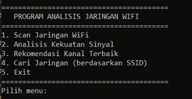
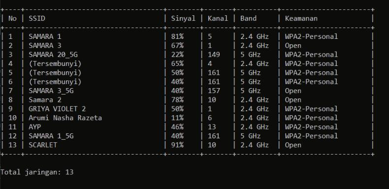
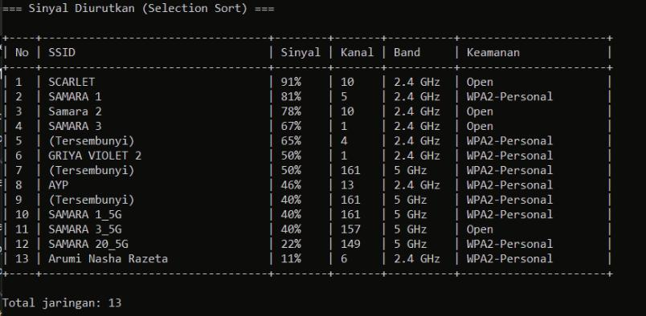
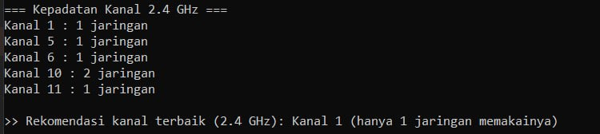
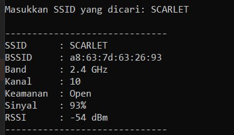

# Projek Akhir WiFi Analyze

Program C++ untuk menganalisis jaringan WiFi di sekitar perangkat Windows.
Program menggunakan perintah bawaan Windows berikut untuk memperoleh data
SSID, BSSID, kekuatan sinyal, channel, dan keamanan jaringan:

```cmd
netsh wlan show networks mode=bssid
```

## File Program

```text
wifi_analyze_windows.cpp
wifi_analyze_windows.exe
docs/images/
```

## Cara Menjalankan

Executable dapat langsung dijalankan melalui Command Prompt:

```cmd
cd /d "%USERPROFILE%\Documents\Projek-Akhir-Wifi-Analyze"
wifi_analyze_windows.exe
```

Untuk melakukan compile ulang dengan MinGW-w64:

```cmd
g++ -std=c++98 -Wall -Wextra -pedantic -static -static-libgcc -static-libstdc++ wifi_analyze_windows.cpp -o wifi_analyze_windows.exe
```

Static linking digunakan agar executable tidak membutuhkan file
`libgcc_s_seh-1.dll` dan `libstdc++-6.dll`.

## Menu Utama



Menu utama menyediakan lima pilihan: scan jaringan, analisis kekuatan sinyal,
rekomendasi channel, pencarian SSID, dan keluar dari program.

## Hasil Scan WiFi



Menu scan menjalankan `netsh`, membaca output melalui pipe, lalu menyimpan setiap
jaringan ke dalam `vector<Wifi>`. Tabel menampilkan SSID, persentase sinyal,
channel, band frekuensi, dan keamanan. Jaringan tanpa nama ditampilkan sebagai
`(Hidden)`.

## Selection Sort



Menu analisis kekuatan sinyal menggunakan algoritma **selection sort** untuk
mengurutkan jaringan dari sinyal paling kuat ke paling lemah. Seluruh data WiFi
ditukar sebagai satu objek agar SSID, channel, keamanan, dan RSSI tetap sesuai.

## Rekomendasi Channel



Program menghitung jumlah jaringan pada setiap channel 2.4 GHz, kemudian
membandingkan channel 1, 6, dan 11. Channel dengan jumlah pemakai paling sedikit
ditampilkan sebagai rekomendasi untuk mengurangi potensi interferensi.

## Binary Search SSID



Menu pencarian menggunakan algoritma **binary search**. Sebelum pencarian,
data WiFi diurutkan terlebih dahulu berdasarkan **SSID**, lalu program mencari
SSID secara exact match dan menampilkan detail SSID, BSSID, band, channel,
keamanan, persentase sinyal, serta estimasi RSSI jika jaringan ditemukan.

## Fitur

1. Scan jaringan WiFi menggunakan `netsh`
2. Menyimpan hasil scan menggunakan `vector`
3. Mengurutkan sinyal menggunakan selection sort
4. Memberikan rekomendasi channel 2.4 GHz
5. Mencari SSID menggunakan binary search
6. Menampilkan estimasi RSSI dalam satuan dBm
